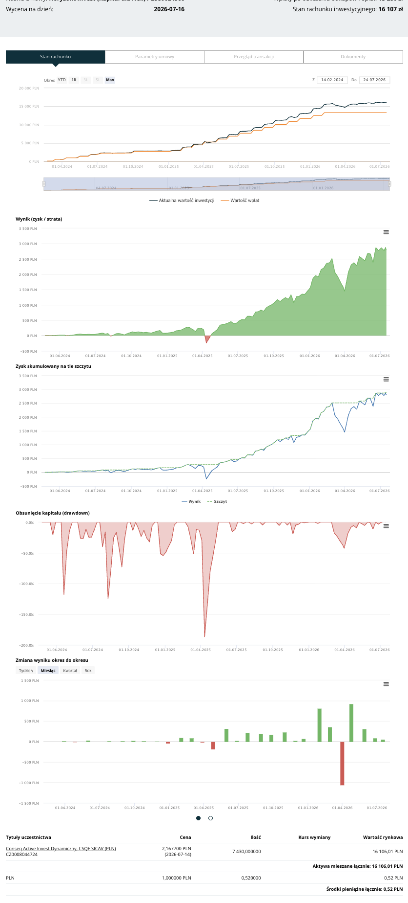

# Conseq Funds Analytics Chrome Extension

A personal, unpublished Chrome extension for the Conseq Funds client portal (`*.conseq.pl`). The portal's own investment chart only shows totals — amount paid in vs. current portfolio value. This extension adds four charts directly below it that break the actual investment performance down in different ways, so real gains/losses are visible at a glance.

It reads the chart data that's already present in the page's HTML (`data-chart-data` attributes) and renders the new charts using the portal's own already-loaded Highcharts instance — no external libraries, no data leaves the page, no build step.

<picture>
  <source media="(prefers-color-scheme: dark)" srcset="charts-example-dark.png">
  <source media="(prefers-color-scheme: light)" srcset="charts-example-light.png">
  
</picture>

> **Note:** management fees appear to already be netted into the portal's own "amount paid in" figures — the account summary labels the equivalent value "Wpłaty po odliczeniu odkupów i opłat" (deposits after deducting redemptions *and fees*), and it matches what the chart data shows. So these charts are likely already net of fees, not gross — this is inferred from that label rather than from an itemized fee breakdown.

## Charts

All four are inserted directly below the portal's own chart, in this order:

1. **Wynik (zysk / strata)** — the core performance chart: `current value − amount paid in`, over time. Green where you're in profit, red where you're at a loss. An input above the chart lets you enter what you actually transferred from your bank account (which can be higher than the portal's own paid-in figure, e.g. due to a front-load fee taken before the deposit is recorded); entering a value overlays a second "Wynik (rzeczywisty kapitał)" line, shifted by the gap between the two, so you can see performance measured against real money out the door. It's saved in your browser's local storage, and it's an approximation — it assumes that gap has been constant over time, since there's no historical ledger of your real transfers to work from.
2. **Zysk skumulowany na tle szczytu** — the same performance line plotted against its running peak (the highest profit reached so far), making it easy to see how far the current value is below its best point. Also reflects the actual-capital input from the Wynik chart above (no separate input here — it just mirrors whatever you entered there), overlaying the equivalent adjusted result and peak.
3. **Obsunięcie kapitału (drawdown)** — the drawdown chart: how far, as a percentage, the current profit has fallen from that running peak. Always ≤ 0%.
4. **Zmiana wyniku okres do okresu** — a bar chart of the change in profit/loss from one period to the next, with buttons to switch the bucket size (Tydzień / Miesiąc / Kwartał / Rok — week/month/quarter/year).

All four charts share the same x-axis range as the portal's own chart and stay in sync with its YTD / 1R / 3L / 5L / Max period selector.

## Install / use locally

This extension is not published on the Chrome Web Store — it's loaded as an unpacked extension:

1. Open `chrome://extensions` in Chrome.
2. Enable **Developer mode** (toggle in the top-right corner).
3. Click **Load unpacked** and select the `extension/` folder in this repo.
4. Log in to your Conseq Funds client portal as usual and open the page with your fund chart. The four charts described above should appear directly below the existing one.

To pick up code changes, click the refresh icon on the extension's card in `chrome://extensions` and reload the portal page.

## Build

```sh
./build.sh
```

Zips the contents of `extension/` into `conseq-performance-chart.zip` at the repo root (e.g. for backing up a specific version, or sideloading elsewhere). This isn't required for local use — "Load unpacked" reads `extension/` directly.

## Tests

```sh
npm test
```

Runs `tests/content.test.js` with Node's built-in test runner (no dependencies to install). It covers the pure logic in `content.js` — chart-data parsing, matching the paid-in/current-value series by name, and the performance diffing math — not the DOM/Highcharts rendering itself, which still needs a live page or a local fixture to check visually.

## How it works

- `extension/content.js` runs on every `https://*.conseq.pl/*` page (see `extension/manifest.json`).
- It looks for `.highchart.fund-compare[data-id]` chart containers, and inside each one reads the two `.chart-definition` elements by their `data-fundname` attribute: `Wartość wpłat` (amount paid in) and `Aktualna wartość inwestycji` (current value).
- It computes `current − paid` for every matching timestamp as the base performance series, then derives the other three charts' data from it: a running peak, a drawdown-from-peak percentage, and a period-bucketed (week/month/quarter/year) delta. All four are rendered as new charts, inserted right after the original chart's `<figure>`, using the portal's own global `Highcharts` object.
- A `MutationObserver` re-scans the page as it changes (e.g. carousel slides loading), so the charts appear even if the original loads asynchronously. Each processed chart block is marked to avoid inserting duplicates.
- The original chart's period buttons (YTD / 1R / 3L / 5L / Max) are Highcharts' own range selector — they zoom the original chart's x-axis, nothing more. The extension finds that chart instance (via the `data-highcharts-chart` index Highcharts stamps on it) and mirrors its visible date range onto each new chart whenever it changes, so all of them stay in sync.

## Project structure

```
extension/
  manifest.json   — Manifest V3 config (host permissions, content script)
  content.js      — all extraction/rendering logic
  images/         — extension icons
tests/
  content.test.js — unit tests for the pure functions in content.js
build.sh          — zips extension/ for packaging
package.json      — `npm test` only; no dependencies, not part of the extension
```
